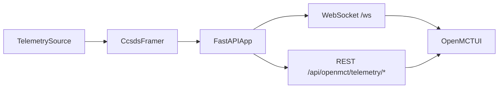

# OpenGround

## Why this exists

OpenGround is a hands-on sandbox for learning how telemetry systems fit together end to end:

- **Telemetry generation** from a lightweight simulator (and optional replay/public-source modes).
- **Framing** with a simplified CCSDS-style primary header plus fixed payload.
- **Backend delivery** through FastAPI HTTP + WebSocket endpoints.
- **Frontend visualization** with Open MCT object tree, live stream, and history queries.

The project optimizes for clarity and iteration speed, not mission readiness. It is intentionally small so protocol, transport, and UI behavior are easy to inspect and evolve.

## Architecture at a glance



- `openground/services/`: simulation, replay, and telemetry service logic.
- `openground/ccsds.py`: simplified packet framing/parsing primitives.
- `openground/routers/`: health, Open MCT API, and WebSocket routes.
- `static/`: Open MCT client wiring.
- `tests/`: behavior and integration-focused test coverage.

## Development workflow (XP)

Repository flow uses an XP-friendly, short-feedback model:

1. Create `feature/*` branches from `development`.
2. Keep changes small and vertical (code + tests + docs in one PR).
3. Open PRs into `development` only.
4. Merge after CI and review checks pass.

Example:

```bash
git switch development
git pull
git switch -c feature/telemetry-throttle
```

## Quality gates

Local checks:

```bash
make lint
make test
make verify
```

CI checks on PRs to `development`:

- Ruff lint + format check
- Pytest
- Coverage report generation (`coverage.xml`)

## Run locally

### Prerequisites

- Python `3.12+`
- `uv`
- Node.js + npm

### Setup and run

```bash
uv sync --group dev
npm install
uv run uvicorn main:app --reload
```

Open `http://127.0.0.1:8000`.

### Docker run

```bash
docker compose up --build
```

Services:

- OpenGround API/UI: `http://127.0.0.1:8000`
- Postgres archive: `127.0.0.1:5433` (db `openground_dev`, user/password `openground` / `openground`)

The app uses `OPENGROUND_DATABASE_URL` in `docker-compose.yml`, so table
`openground_telemetry` is auto-created at startup when Postgres is healthy.

### Telemetry modes

- `sim` (default) with `OPENGROUND_SCENARIO`: `nominal`, `sport`, `gentle`, `stress`
- `milestone_replay` with an explicit `OPENGROUND_MILESTONE_TIMELINE_PATH`
- `iss_public` (network-dependent public API feed)
- `ingest_only` to disable all synthetic/internal producers and accept only external ingest

Legacy mapping: `artemis_timeline` -> `milestone_replay`.

## API surface

- WebSocket: `/ws`
- REST:
  - `GET /api/openmct/telemetry/latest`
  - `GET /api/openmct/telemetry/history?start=&end=` (epoch ms)
  - `GET /api/openmct/telemetry/schema` (numeric channel keys discovered from latest/history)
  - `POST /api/v1/ingest/telemetry` (normalized scalar payload)
  - `POST /api/v1/ingest/packet` (octet-stream or JSON `packet_base64`)
  - `POST /api/v1/adapters/envelope` (generic wrapper with `external_event_id`, `event_type`, `payload`)

Envelope adapter compatibility note:

- `external_event_id` is the preferred field.
- `relay_event_id` is accepted as a backward-compatible alias.

Environment references live in `openground/config.py` and `.env.example`.

## Troubleshooting

- If tests touching Open MCT assets fail, run `npm install` (or `npm ci`) so `node_modules/openmct/dist` exists.
- If static UI is missing, ensure backend is running and `http://127.0.0.1:8000` is reachable.

## Stack and versions

- Python `>=3.12`
- FastAPI + Uvicorn
- Open MCT (`package.json`)
- Ruff + Pytest (+ coverage in CI)
- GitHub Actions

## License

MIT — see `LICENSE`.